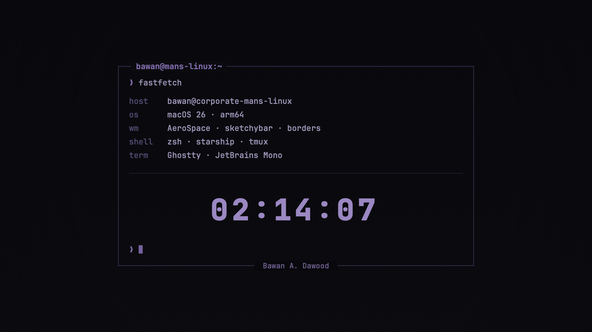

# Corporate Man's Linux — screensaver

A retro **matte cyberdeck** macOS screen saver, styled as a fake terminal: a
box-drawing window with a `bawan@mans-linux:~` titlebar, a fastfetch-style
system readout, a large flat clock, and a blinking prompt cursor — all in a
dimmed, desaturated violet phosphor palette. JetBrains Mono type, faint flat
CRT scanlines, a subtle vignette, and the `Bawan A. Dawood` trademark set into
the bottom border. No neon glow, no glitch, no synthwave sun or grid — flat and
low-key by design.

It's a **native `ScreenSaverView`** (Core Graphics, no WebView) so it runs
inside the sandboxed screen-saver host on modern macOS. Everything is drawn
relative to the view height, so it looks right in the tiny System-Settings
thumbnail and on a 6K display alike.



## Layout

```
screensaver/
├── Sources/
│   ├── Scene.swift      # the renderer — palette, frame, readout, clock, cursor
│   ├── SaverView.swift  # @objc(CorporateMansLinuxView) ScreenSaverView subclass
│   └── main.swift       # offline PNG renderer (design iteration only, not shipped)
├── Info.plist           # NSPrincipalClass = CorporateMansLinuxView
├── build.sh             # compile + assemble CorporateMansLinux.saver (bundles fonts, ad-hoc signs)
├── install.sh           # copy the .saver into ~/Library/Screen Savers/
└── preview.png          # still frame
```

## Build & install

```bash
./build.sh      # -> build/CorporateMansLinux.saver
./install.sh    # -> ~/Library/Screen Savers/CorporateMansLinux.saver
```

`build.sh` bundles the JetBrains Mono TTFs from `~/Library/Fonts` into the
saver's `Resources/` (registered at runtime via `CTFontManagerRegisterFontsForURL`),
so the type is correct even in the sandbox. If the fonts aren't found it falls
back to Menlo.

Built for `arm64` (Apple Silicon). For an Intel Mac, change `TARGET` in
`build.sh` to `x86_64-apple-macos12`.

## Select it

**System Settings ▸ Screen Saver**, scroll to **Other**, pick **Corporate
Man's Linux**. If it doesn't show up right away, log out and back in (or
`killall cfprefsd`) to refresh the saver list.

## Preview without waiting for idle

```bash
/System/Library/CoreServices/ScreenSaverEngine.app/Contents/MacOS/ScreenSaverEngine
```

(Move the mouse / press a key to exit.)

## Iterate on the look

The renderer is decoupled from the saver so you can render stills to PNG and
review them without touching the display:

```bash
xcrun swiftc Sources/Scene.swift Sources/main.swift -o /tmp/preview \
  -framework AppKit -framework CoreText -target arm64-apple-macos12
/tmp/preview ./frames        # writes a few full-size stills + a thumbnail
```

Tunables live in `terminal(...)` in `Scene.swift`:

- **Frame geometry** — `bx0/bx1/by0/by1` (the box rect) and `pad` (inner margin).
- **Type scale** — `bodySize` drives the whole readout; the clock is `H * 0.09`
  (auto-shrinks to fit the box width).
- **Content** — the `readout` rows, plus `titlebar` and `trademark` strings on
  `SceneRenderer`.
- **Palette** — `enum Pal`, all desaturated violet. Swap those hex values for
  amber or green to reskin the whole thing; nothing else is colour-coded.
- **Cursor blink** — the `time.truncatingRemainder(dividingBy: 1.0) < 0.5` check
  in the bottom prompt.

## Notes on macOS 26 (Tahoe)

Third-party `.saver` bundles still work but the host is heavily sandboxed. This
one is a pure native renderer (no network, no WebView) and is ad-hoc signed by
`build.sh`, and because it's built locally it isn't quarantined — so it loads
without Gatekeeper prompts. If a future OS refuses unsigned savers outright,
sign with a Developer ID:

```bash
codesign --force --deep --sign "Developer ID Application: <you>" \
  ~/Library/Screen\ Savers/CorporateMansLinux.saver
```

## Uninstall

```bash
rm -rf ~/Library/Screen\ Savers/CorporateMansLinux.saver
```
